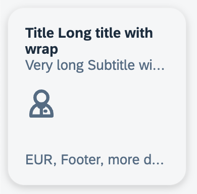

# Generic Tile Webcomponent Based on UI5 Webcomponents

 This webcomponent based is based on UI5 Webcomponents and should be a minimal implementation of the Generic Launch Tile described in the [UI5 Documentation - Generic Launch Tile](<https://ui5.sap.com/#/entity/sap.m.GenericTile/sample/sap.m.sample.GenericTileAsLaunchTile>).

 Goal is to have a theme-able, i18n-aware and easy to use component adhering to the Fiori Design guidelines, therefore it is based on the UI5 webcomponent framework.

 

## Open Tasks

- [ ] Write tests
- [X] Add hover effect
- [ ] Add loading state behavior?
- [ ] Fix icon position
- [ ] Add pressed state
- [ ] Clean up css

## Project Setup Notes

When creating the project by

```bash
    npm init @ui5/webcomponents-package
```

and providing the neccessary input the project will not start initially.
You need to add two changes to the generated code:

1. Create a ".npsrc.json" file with the folling content:

```json
{
    "config": "./package-scripts.cjs"
}
````

1. Add the folloging config to the package.json

```json
    "type": "module"
````

at the root level.
